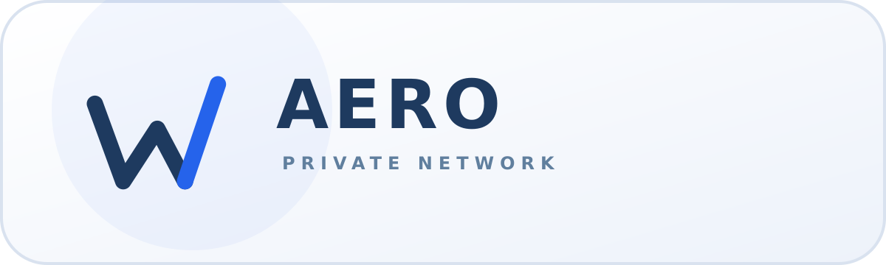
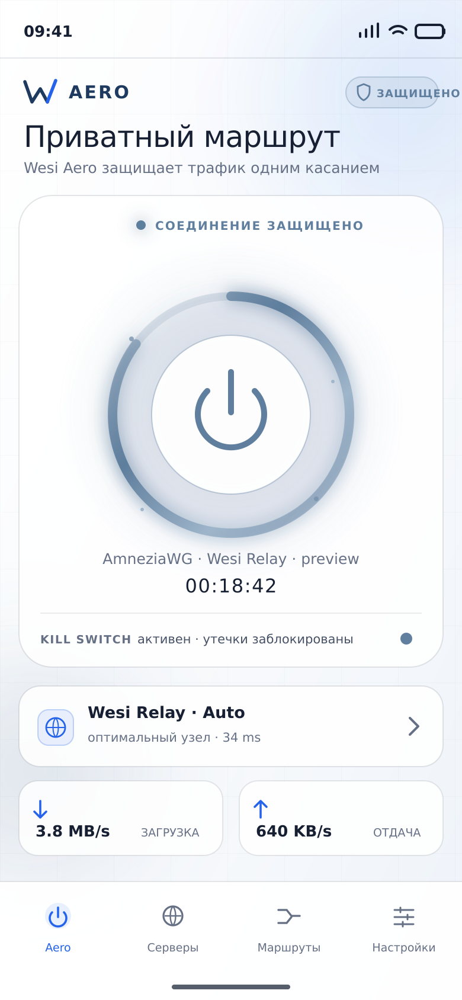

# Wesi Aero



Кроссплатформенный клиент приватного сетевого шлюза для Android и Windows в
визуальном языке WesiOS. Репозиторий содержит:



- адаптивный Flutter-клиент с анимированным главным экраном;
- безопасный демонстрационный движок для проверки интерфейса без изменения
  системной маршрутизации;
- контракт нативного туннельного хоста для Android и Windows;
- минимальный проверяемый control plane на Node.js 24 + SQLite;
- тарифы, ключи, device-seat enforcement и платёжные адаптеры;
- отдельное приложение Wesi Aero Admin для Android и Windows;
- архитектурные и эксплуатационные документы.

## Быстрый запуск интерфейса

Требуется Flutter stable с Dart 3.8+. Нативные директории намеренно создаются
из актуального Flutter-шаблона, чтобы не фиксировать устаревшие Gradle/CMake
файлы.

```bash
./scripts/bootstrap_platforms.sh
flutter run --dart-define=WESI_AERO_DEMO=true
```

На Windows используйте `powershell -ExecutionPolicy Bypass -File
scripts/bootstrap_platforms.ps1`. Скрипты создают Android/Windows scaffolds во
временной папке, не перезаписывают исходники и выставляют Android minSdk 23,
который требуется актуальному secure storage.

`WESI_AERO_DEMO=true` включён по умолчанию. В этом режиме кнопка подключения,
состояния и телеметрия работают, но TUN-интерфейс не создаётся. Это исключает
случайную потерю сети до интеграции и аудита нативного ядра.

## Запуск control plane

```bash
cd server-node
npm test
WESI_AERO_ADMIN_TOKEN='replace-with-a-long-random-secret' npm start
```

По умолчанию API слушает только `127.0.0.1:8790`. Публиковать его напрямую в
Интернет нельзя: в production он должен находиться за отдельным TLS reverse
proxy, а доступ к административным маршрутам — ограничиваться сетью управления.

## Найденный foreign relay WesiOS

В исходниках WesiOS найден публичный зарубежный узел
`wesi-ai-178-236-247-194.nip.io` (IP, зашитый в hostname: `178.236.247.194`).
Он подтверждён как работающий Wesi AI Relay, но VLESS/REALITY и AmneziaWG на нём
ещё не развёрнуты. Wesi Aero использует его как целевой VPS для будущей установки,
а не как готовый VPN endpoint.

Чтобы не конфликтовать с Wesi AI, foundation резервирует для Wesi Aero
`8790/TCP` (control plane), `8443/TCP` (REALITY) и `51820/UDP` (AmneziaWG).
Значения SSH-ключей и HMAC/API-токенов в проект не копируются. Полный разбор:
[docs/INFRASTRUCTURE_DISCOVERY.md](docs/INFRASTRUCTURE_DISCOVERY.md).

## Что уже входит в первый инкремент

- главный экран: статус, анимированная кнопка, сервер, ping, скорость и трафик;
- список серверов с задержкой и нагрузкой;
- split tunneling: режимы «весь трафик», allowlist и denylist;
- настройки протокола, Kill Switch, автоподключение и импорт конфигурации;
- мобильная нижняя навигация и desktop NavigationRail;
- светлая тема WesiOS по умолчанию и дополнительная тёмная тема с едиными токенами;
- lease-модель для ограничения активных сессий и квоты трафика;
- отсутствие хранения доменов, URL, DNS-запросов и истории посещений.

## Важная граница готовности

UI и control plane являются рабочей базой MVP. Для production-туннеля необходимо
подключить и отдельно протестировать:

1. Xray-core для VLESS + REALITY;
2. официальные AmneziaWG-компоненты для Android и Windows;
3. Android `VpnService` и Windows Wintun/WFP host service;
4. серверный сбор подтверждённого трафика из Xray/AWG, а не из данных клиента;
5. подписывание обновлений, crash recovery Kill Switch и ротацию ключей.

Подробности: [docs/ARCHITECTURE.md](docs/ARCHITECTURE.md),
[docs/DESIGN_SYSTEM.md](docs/DESIGN_SYSTEM.md) и
[docs/PRODUCTION_ROADMAP.md](docs/PRODUCTION_ROADMAP.md). Контракт второго этапа:
[docs/STAGE2_ADMIN_AND_BILLING.md](docs/STAGE2_ADMIN_AND_BILLING.md).
