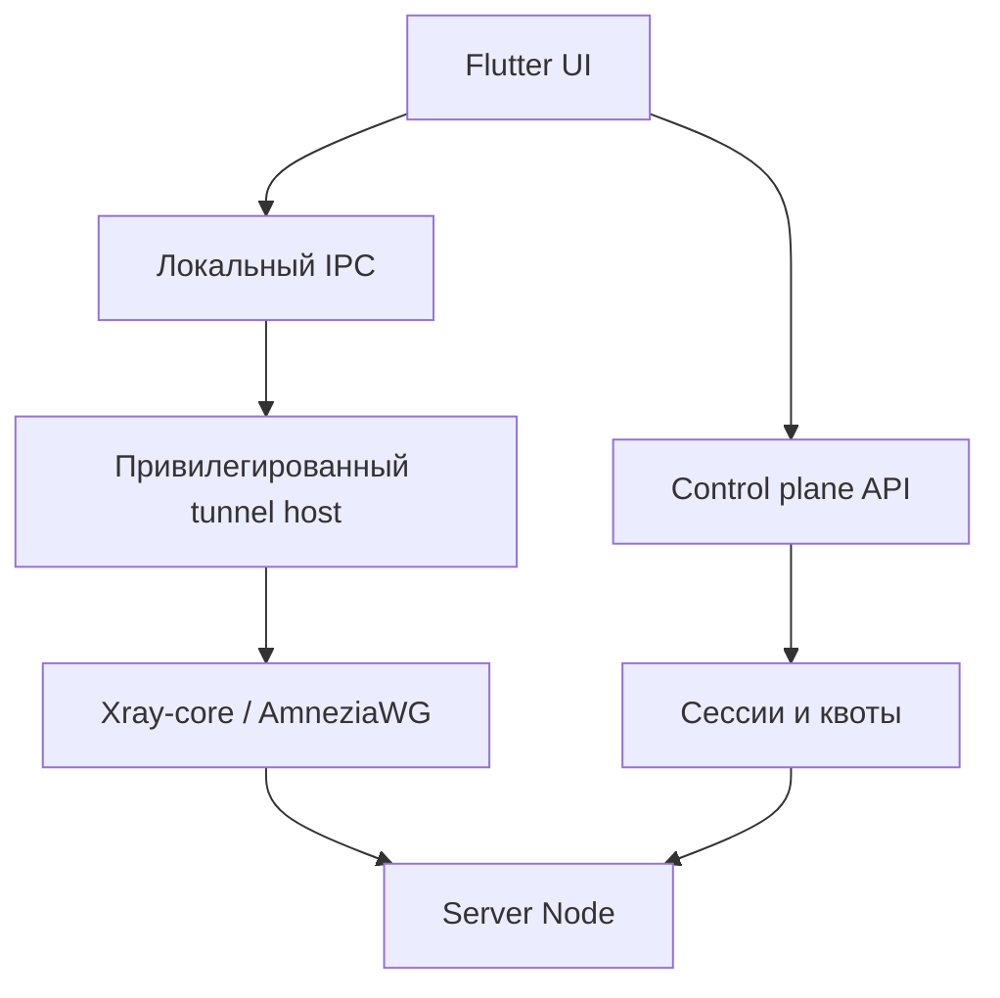

# Архитектура Wesi Aero

## Цель

Wesi Aero разделяет отображение, управление доступом и обработку пакетов. Flutter
не реализует криптографию и не держит привилегии администратора: он управляет
состоянием и отправляет строго типизированные команды нативному host service.

## Границы доверия

| Компонент | Права | Хранит | Не должен хранить |
| --- | --- | --- | --- |
| Flutter UI | обычный пользователь | настройки UI, публичные сведения об узлах | приватные ключи в открытом виде |
| Android host | `VpnService` | активный профиль в Android Keystore-backed storage | URL и DNS-историю |
| Windows host service | LocalSystem с минимальным ACL | зашифрованный профиль, WFP policy state | UI-токены и историю ресурсов |
| Control plane | отдельный системный пользователь | verifier токена, lease, месячные byte counters | исходный токен, URL, домены, DNS-запросы |
| Data plane | сетевые привилегии | текущую конфигурацию и оперативные counters | журналы доступа |

## Клиент

### Общий Flutter-слой

- экран подключения и визуальная телеметрия;
- выбор узла и протокола;
- split tunneling rules;
- импорт и предварительная проверка профиля;
- heartbeat lease и восстановление UI после рестарта;
- локализация и доступность.

Канал Flutter → host: `com.wesi.aero/gateway`. Поток событий host → Flutter:
`com.wesi.aero/gateway-events`. Сырые пакеты через platform channel не
передаются.

### Android

1. Запрос согласия через `VpnService.prepare()`.
2. Foreground service создаёт TUN только после готовности transport core.
3. `VpnService.Builder.addAllowedApplication()` или
   `addDisallowedApplication()` применяется до `establish()`; одновременно эти
   списки не смешиваются.
4. Смена правил пересоздаёт интерфейс.
5. Смена Wi‑Fi/LTE отслеживается через `ConnectivityManager.NetworkCallback`.
6. Максимально надёжный Kill Switch опирается на системные Always-on VPN +
   «Block connections without VPN». В UI нужно вести пользователя к этой
   настройке и показывать фактическое состояние.

### Windows

1. Отдельная подписанная Windows Service владеет Wintun и WFP-фильтрами.
2. Flutter-процесс общается с ней через именованный канал с ACL текущего SID.
3. Kill Switch реализуется WFP-фильтрами: разрешены только loopback, DHCP,
   bootstrap DNS при необходимости и IP выбранного Server Node.
4. Service сохраняет состояние policy и безопасно восстанавливает его после
   crash/reboot. UI не меняет глобальный firewall через shell-команды.
5. Изменение интерфейсов отслеживается через IP Helper API; tunnel core получает
   команду rebind/reconnect.

## Транспортные ядра

### VLESS + REALITY

- использовать pinned release Xray-core, а не собственную реализацию;
- серверный inbound: VLESS, REALITY, `xtls-rprx-vision`;
- transport выбирается из поддерживаемых текущим Xray вариантов (`raw`, XHTTP
  или gRPC), с отдельным interoperability-тестом;
- access log отключён; user uplink/downlink stats включены;
- конфигурация пользователя связывается с непрозрачным внутренним ID, а не с
  email или ФИО.

Официальная документация: [Xray REALITY](https://xtls.github.io/en/config/transports/reality.html),
[Xray-core](https://github.com/XTLS/Xray-core).

### AmneziaWG

- Android использует официальный AmneziaWG Android engine;
- Windows — официальный клиентский engine на базе Wintun;
- сервер использует совместимую pinned-версию kernel module или
  `amneziawg-go`;
- параметры обфускации генерируются инструментами той же версии, а не
  копируются между несовместимыми AWG-релизами.

Официальные исходники: [AmneziaWG Android](https://github.com/amnezia-vpn/amneziawg-android),
[AmneziaWG Windows](https://github.com/amnezia-vpn/amneziawg-windows-client),
[amneziawg-go](https://github.com/amnezia-vpn/amneziawg-go).

## Lease, лимиты и учёт

1. Клиент авторизуется токеном `wsg.<user-id>.<secret>`.
2. База хранит только `scrypt` verifier с индивидуальной солью.
3. Перед подключением клиент запрашивает lease на `deviceId + node + protocol`.
4. `BEGIN IMMEDIATE` атомарно проверяет лимит активных сессий и месячную квоту.
5. Lease имеет TTL 120 секунд и продлевается heartbeat. Повторный lease того же
   устройства замещает старый, чтобы смена сети не съедала лимит.
6. Byte counters поступают только от data plane collector. Данные клиента для
   биллинга и квот не считаются доверенными.

SQLite подходит для одного control plane. Для нескольких реплик lease и quota
transaction нужно перенести в PostgreSQL/Redis с единой согласованной точкой
учёта.

## No-Logs policy

Разрешённые технические данные:

- ID пользователя и устройства;
- выбранный node/protocol;
- время открытия, heartbeat и завершения lease;
- агрегированный объём входящего/исходящего трафика;
- код технической ошибки без адреса назначения.

Запрещённые данные:

- URL, домены, SNI назначения и DNS queries;
- IP-адреса посещённых ресурсов;
- payload пакетов;
- исходные access tokens;
- request body профиля в HTTP/exception logs.

Xray access log должен оставаться `none`. Технические журналы control plane не
содержат request body и query string и получают короткий retention.

## Ротация ключей

- access token: отозвать старый verifier и выдать новый токен однократно;
- WireGuard/AWG peer: создать next key, держать короткое overlap-окно, обновить
  устройство и удалить old peer;
- REALITY server key: публиковать `current` и `next` профиль через подписанный
  control plane, затем переключать узел и отзывать старый ключ;
- ключ подписи обновлений хранить офлайн/HSM и не совмещать с ключами туннеля.

## Производительность и надёжность

- UDP и ICMP должны тестироваться отдельно от HTTP speed test;
- p50/p95 overhead измеряется относительно прямого ping до того же узла;
- целевое добавление 5–10% достижимо только для близких узлов и не может быть
  глобальной гарантией;
- Android: foreground service без wakelock в idle, batching телеметрии 1 Hz в UI
  и более редкий heartbeat в фоне;
- Server Node: минимум два независимых узла, health checks, автоматический drain
  и обновление без разрыва всех lease;
- 99.9% оценивается на rolling 30 days по data-plane probes, а не только `/healthz`.
